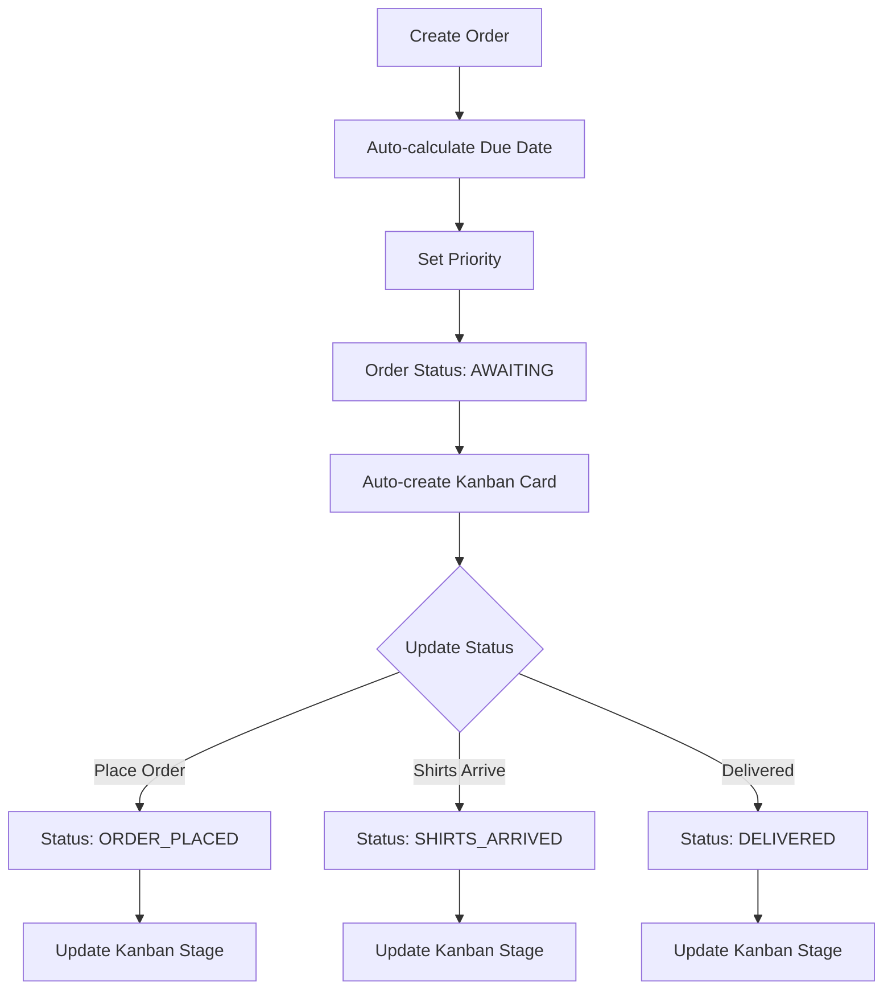
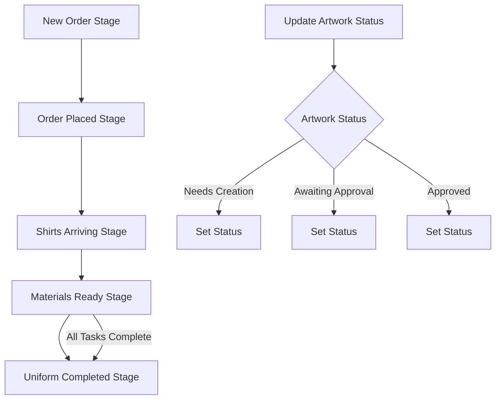
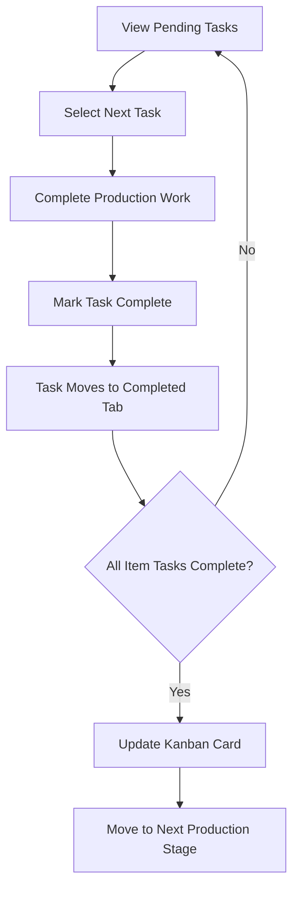
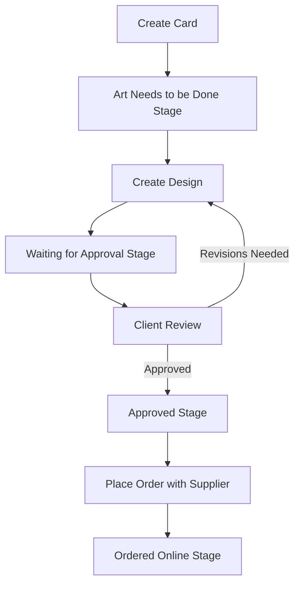

# Workflow Documentation

This document details the primary workflows and business processes for the AZ Team Order Tracker system.

## 1. Supplier Order Management Workflow

### Process Steps

1. **Order Creation**
   - Capture client information (name + phone)
   - Select items with sizes, quantities, and production methods
   - System automatically calculates time estimates
   - System automatically suggests due date based on quantity tiers
   - Option to manually adjust due date if needed
   - Flag priority orders

2. **Production Timeframe Calculation**
   - System checks total quantity across all items
   - Applies business rule (1-10 shirts: 5 days, 10-50 shirts: 10 days)
   - Excludes weekends from calculation
   - Displays calculated due date

3. **Status Management**
   - Initial status: AWAITING
   - Update to ORDER_PLACED when supplier order is submitted
   - Update to SHIRTS_ARRIVED when blank shirts arrive from supplier
   - Update to DELIVERED when order is completed and delivered to customer

4. **Kanban Integration**
   - Order creation automatically creates card in first Kanban stage
   - Status updates trigger Kanban card movement
   - AWAITING → Stage: New Order
   - ORDER_PLACED → Stage: Order Placed
   - SHIRTS_ARRIVED → Stage: Shirts Arriving/Materials Ready

## 2. Shirt Production Kanban Workflow

### Process Steps

1. **Card Movement**
   - Cards begin in "New Order" stage when created from Order Tracker
   - Cards move through stages as production progresses
   - Cards can be manually moved via drag-and-drop
   - Cards can automatically advance when tasks are completed

2. **Artwork Status Management**
   - Each card tracks artwork separately from production stage
   - Update artwork status directly from card interface
   - Artwork status transitions:
     - Needs Creation → Awaiting Approval → Approved

3. **Stage Criteria**
   - **New Order**: Order has been created but not yet placed with supplier
   - **Order Placed**: Order has been submitted to supplier
   - **Shirts Arriving**: Shirts are in transit from supplier
   - **Materials Ready**: All materials required for production are available
   - **Uniform Completed**: Production is complete, ready for delivery

4. **Task Integration**
   - Moving card to "Materials Ready" generates production tasks
   - Completing all production tasks triggers card move to "Uniform Completed"

## 3. Task Execution Workflow

### Process Steps

1. **Task Generation**
   - Tasks are auto-generated based on item's production method
   - Each method creates different task types
   - System calculates time estimates for each task

2. **Task Management**
   - Tasks appear in "Pending Tasks" tab
   - Tasks are sorted by priority and then due date
   - Optional grouping by production method
   - Completing a task moves it to "Completed Tasks" tab

3. **Heat Transfer Vinyl Tasks Sequence**
   1. Cut Vinyl (5 min/unit)
   2. Weed Vinyl (3 min/unit)
   3. Press Shirts (2 min/unit)

4. **Sublimation Tasks Sequence**
   1. Print Design (1 min/unit)
   2. Press (2 min/unit)

5. **Embroidery Tasks Sequence**
   1. Digitize (15 min/unit)
   2. Production (30 min/unit)

6. **Kanban Integration**
   - Completing all tasks for an item can automatically update Kanban card
   - Completed items can move Kanban card to "Uniform Completed" stage

## 4. Business Card Workflow

### Process Steps

1. **Card Creation**
   - Create new card with client information
   - Add specifications and requirements
   - Set priority flag if urgent
   - Card starts in "Art Needs to be Done" stage

2. **Design Process**
   - Create artwork based on specifications
   - Upload design files to card for reference
   - Move card to "Waiting for Approval" when ready for client review

3. **Approval Process**
   - Client reviews design
   - If changes needed, return to design stage
   - Move to "Approved" stage when client approves

4. **Order Fulfillment**
   - Place order with business card supplier
   - Add order details to card
   - Move to "Ordered Online" stage
   - Update when cards are received and delivered

## Status Transition Rules

### Order Status Transitions
- **AWAITING → ORDER_PLACED**: When supplier order is submitted
- **ORDER_PLACED → SHIRTS_ARRIVED**: When blank shirts are received
- **SHIRTS_ARRIVED → DELIVERED**: When customization is complete and delivered

### Kanban Stage Transitions
- **New Order → Order Placed**: When supplier order is placed
- **Order Placed → Shirts Arriving**: When shirts are in transit
- **Shirts Arriving → Materials Ready**: When all materials are ready
- **Materials Ready → Uniform Completed**: When all production is complete

### Business Card Stage Transitions
- **Art Needs to be Done → Waiting for Approval**: When design is ready for review
- **Waiting for Approval → Approved**: When client approves design
- **Approved → Ordered Online**: When order is placed with supplier

## Automation Rules

1. **Order Creation → Kanban Card**
   - New orders automatically generate a Kanban card in first stage

2. **Kanban Card Stage → Tasks**
   - Cards entering "Materials Ready" stage generate production tasks

3. **Task Completion → Kanban Card Update**
   - Completing all tasks moves card to "Uniform Completed" stage

4. **Order Status → Kanban Card Stage**
   - Order status updates can move Kanban card to corresponding stage